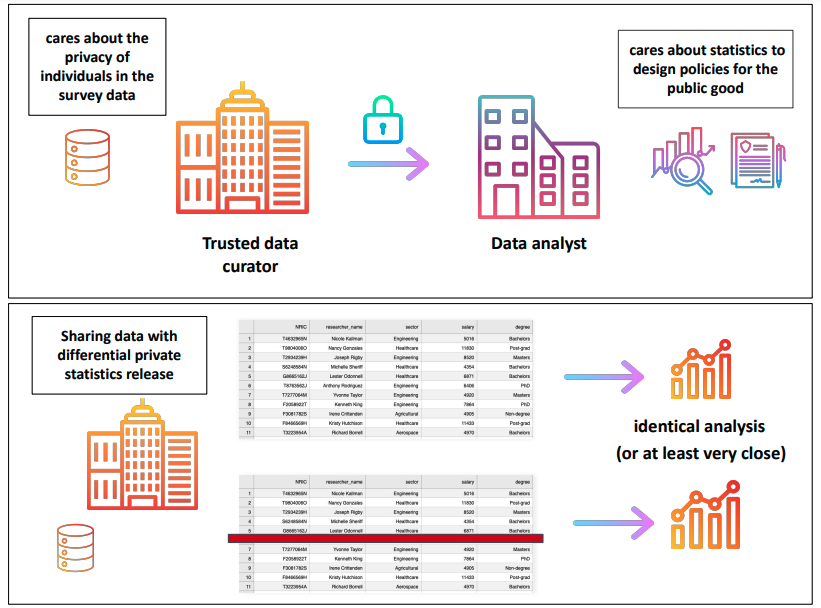

#  Workshop on Differential Private Statistics Release 

Differential privacy is a rigorous mathematical definition of privacy. An algorithm (such as computing a data's mean, sum, count, etc.) is said to be differentially private if by looking at the output, one cannot tell whether any individual's data was included in the original dataset or not. In other words, the guarantee of a differentially private algorithm is that its behavior hardly changes when a single individual joins or leaves the dataset -- providing individuals with plausible deniability synonymous to privacy.

<br>

  

<br>

In this workshop you will learn how to [generate and release basic statistical outcomes](https://github.com/anshu-gt/STACK_2022_differential_privacy_workshop/blob/main/reseachers_survey_stats_release.ipynb) in differentially private manner. We will specifically release the following queries that the data analyst requested from the trusted data curator/holder. The data curator holds a survey data on researchers (sythetically generated).

- Count of researchers
- Sum of researchers' income
- Mean of researchers' income
- Count of researchers by sector
- Count of researchers by sector and academic degree

The data curator values the privacy of thier survey participants, so they want to make sure that the data they release does not reveal anything about specific individuals. This is a perfect use case for differential privacy: it will allow us to publish useful insights about groups, while protecting data about individuals.

We will also visualise and learn the impact of the below variables on the accuracy of the queries: 
- **Epsilon(ε)**: The privacy loss incurred by researchers in the dataset. Larger values indicate less privacy and more accuracy.
- **Sensitivity**: The worst case change in a query's output when a row is removed/added. Noise scales with the sensitivity of a query.
- **Clamping bounds**: Clipping the raw values to the set lower and upper bounds. Noise scales with the size of the bounds.
- **Dataset size**: With a larger dataset size, noise cancels out, improving accuracy.

You will also be introduced to the concepts of **parallel composition** and **post-processing**.

Additionally, we have prepared [this notebook](https://github.com/anshu-gt/STACK_2022_differential_privacy_workshop/blob/main/mechanisms.ipynb) for you to visualise and understand the basic mechanisms (algorithms) -- Laplacian and Gaussian. The underlying distributions, [Laplace](https://en.wikipedia.org/wiki/Laplace_distribution) and [Gaussian](https://en.wikipedia.org/wiki/Normal_distribution), satisfy the differential privacy definition (pure and approximate, respectively) and add randomised noise to the statistics.
Further, you will gain an understanding of how privacy parameters affect the noise scale (variance of a distribution).

Also, please refer to [this notebook](https://github.com/anshu-gt/STACK_2022_differential_privacy_workshop/blob/main/generate_data.ipynb) if you want to create a synthetic dataset.

For this workshop, participants are only required to have some basic python programming knowledge.  


## Getting started :rocket:	

You can either use the online colab notebook here [add link] or set up a local Jupyter notebook by following the steps below.

Install jupyter notebook 
```
pip install jupyterlab
```

Git clone the repository
```
git clone https://github.com/anshu-gt/STACK_2022_differential_privacy_workshop
```

Install dependencies
```
pip install -r requirements.txt
```

Run jupyter notebook in terminal
```
jupyter lab
```

> The code has been developed with python `3.8`.

## Resources :books:
These are some of the resources that can be of help to you:

#### Articles and videos:
- [Damien Desfontaines differential privacy series](https://desfontain.es/privacy/friendly-intro-to-differential-privacy.html)
- [A friendly video on reconstruction attack](https://www.youtube.com/watch?v=pT19VwBAqKA) by [MinutePhysics](https://en.wikipedia.org/wiki/MinutePhysics)
- [Programming Differential Privacy: A book about differential privacy](https://programming-dp.com/intro.html) 

#### Papers  
- [Differential Privacy: A Primer for a Non-technical Audience](https://privacytools.seas.harvard.edu/files/privacytools/files/pedagogical-document-dp_0.pdf)
- [The Algorithmic Foundations of Differential Privacy by Cynthia Dwork](https://www.cis.upenn.edu/~aaroth/Papers/privacybook.pdf)

#### Courses
- [Differential Privacy course by Gautam Kamath of University of Waterloo](http://www.gautamkamath.com/CS860-fa2020.html)  

#### Differential Privacy Libraries 
- [OpenDP by folks at the Harvard Privacy Tools Project](https://github.com/opendp/opendp)
- [Tumult Analytics](https://gitlab.com/tumult-labs/analytics) and [Tumult Core](https://gitlab.com/tumult-labs/core) by [Tumult Labs](https://www.tmlt.io/)
- [Diffprivlib by IBM](https://github.com/IBM/differential-privacy-library)
- [Differntial Privacy library by Google](https://github.com/google/differential-privacy) 


## Contributor :nerd_face:	
@anshu-gt (contact: anshu@dsaid.gov.sg)

:muscle: by Data Privacy Protection Capability Centre by GovTech
